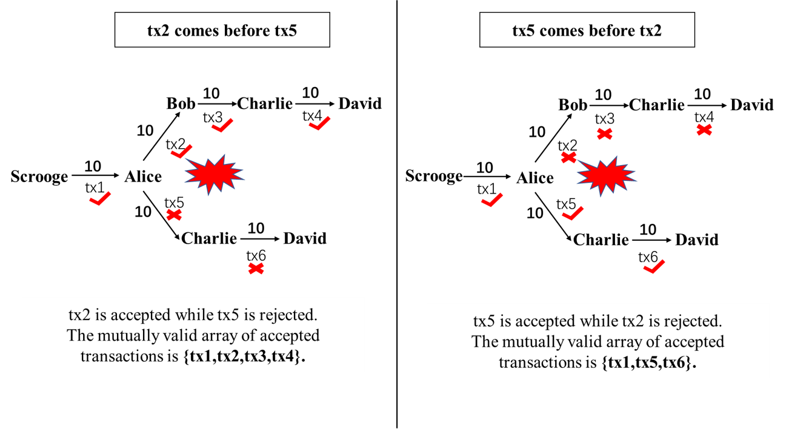
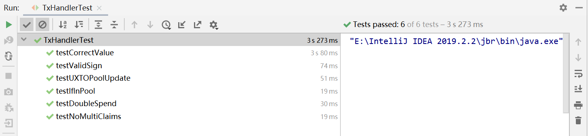

# Homework 1 : ScroogeCoin
**Name**: He Junxian  何隽贤 
**ID**:1901212583

# Summary
In this homework, we are required to implement the ScroogeCoin mechanism discussed in class. Provided
with the **_Transaction_**, **_UTXO_**, **_UTXOPool_** classes, we implement the **_TxHandler_** class and design the test suite to test
our implementation.

# Implementation of Txhandler class
Our **_Txhandler_** class consists of: 
* an inner class **_uPool_**, the current collection of unspent transaction outputs,
* constructor **_TxHandler(UTXOPool uPool)_**, which makes a defensive copy of
**_uPool_** by using the **_UTXOPool(UTXOPool uPool)_** constructor,
* **_isValidTx(Transaction tx)_**, which validates a transaction according to 5 conditions:
  * all outputs claimed by tx are in the current **_uPool_**,  
  * the signatures on each input of tx are valid,  
  * no UTXO is claimed multiple times by tx, 
  * all of output values of tx are non-negative, and 
  * the sum of input values of tx is greater than or equal to the sum of its output values.
* **_handleTxs(Transaction[] possibleTxs)_**, which receives an unordered array of proposed transactions **_possibleTxs_** 
as input, validates each transaction, returns a mutually valid array of accepted transactions, and
updates the current **_uPool_** by removing spent UXTOs and adding newly created UXTOs.

**All related codes of **_Txhandler_** class along with detailed annotations are in _TxHandler.java_ file.**

# Design of test suite
After we implement the **_TxHandler_** class, we need to verify if our ScroogeCoin mechanism works properly.
Here we use JUnit to design and execute the test suite. Before we design each test function, we need to define 3 important 
functions as preparations: **_GenesisTx(), generateKeypair(), signMessage()_**, which will be firstly introduced as follows.

## Preparations
* **_GenesisTx()_** is to generate the genesis transaction(coins). The genesis transaction only consists of one output: 
10 coins are created and transferred to Scrooge. This newly created output is then added to **_uPool_**.
```java
	private void GenesisTx() {
    		genesisTx = new Transaction();
    		// at the very beginning, 10 coins are created for Scrooge
    		genesisTx.addOutput(10, ScroogeKeypair.getPublic());
    		genesisTx.finalize();
    		UTXOPool upool = new UTXOPool();
    		// the newly created output is added to uPool
    		UTXO utxo = new UTXO(genesisTx.getHash(), 0);
    		upool.addUTXO(utxo, genesisTx.getOutput(0));
    
    		txHandler = new TxHandler(upool);
    	}
```
* **_generateKeypair()_** is to generate KeyPairs of 5 identities: **_Scrooge, Alice, Bob, Charlie, David_**, which will be used
in the test procedure.
```java
private void generateKeypair() throws NoSuchAlgorithmException, NoSuchProviderException {
		KeyPairGenerator keyGen = KeyPairGenerator.getInstance("DSA", "SUN");
		SecureRandom random = SecureRandom.getInstance("SHA1PRNG", "SUN");
		keyGen.initialize(1024, random);
		ScroogeKeypair = keyGen.generateKeyPair();
		AliceKeypair = keyGen.generateKeyPair();
		BobKeypair = keyGen.generateKeyPair();
		CharlieKeypair = keyGen.generateKeyPair();
		DavidKeypair=keyGen.generateKeyPair();
	}
```
* **_signMessage()_** is to sign the message with a private key.
```java
private byte[] signMessage(PrivateKey sk, byte[] message)
		throws NoSuchAlgorithmException,NoSuchProviderException,SignatureException,InvalidKeyException {
		Signature sig = Signature.getInstance("SHA1withDSA", "SUN");
		sig.initSign(sk);
		sig.update(message);
		return sig.sign();
	}
```

## Test funcions
In this part, we will illustrate all 6 test functions one by one, including the function's purpose and 
the details of test cases we design.

### Function1: **testIfInPool()**
#### **Purpose**
**_testIfInPool()_** is to test whether **_isValidTx()_** can identify invalid transactions with claimed outputs
that are not in the current **_uPool_**, i.e. condition (1) of **_isValidTx()_**.

#### **Test Case and Analysis**
* Generate the genesis transaction.
* In tx1, Scrooge transfers 10 coins to Alice, claiming the output in the genesis transaction.
* In tx2, Scrooge again transfers 10 coins to Alice, claiming the same output in the genesis transaction.
* Because the output in genesis transaction has already been spent in tx1, **_uPool_** no longer contains this output.
tx2 claims the same output in genesis transaction which is no longer in the current **_uPool_**, thus tx2 is invalid.

#### **Code**
```java
public void testIfInPool()
	  throws InvalidKeyException, NoSuchAlgorithmException, NoSuchProviderException, SignatureException{
		//the newly created output in genesis Tx is in the current uPool
		UTXO utxo = new UTXO(genesisTx.getHash(), 0);
		assertTrue(txHandler.uPool.contains(utxo));

		// Scrooge transfers 10 coins to Alice
		Transaction tx1 = new Transaction();
		tx1.addInput(genesisTx.getHash(), 0);
		tx1.addOutput(10, AliceKeypair.getPublic());
		byte[] sig1 = signMessage(ScroogeKeypair.getPrivate(), tx1.getRawDataToSign(0));
		tx1.addSignature(sig1, 0);
		tx1.finalize();
		Transaction[] acceptedTxs = txHandler.handleTxs(new Transaction[] { tx1 });
		assertEquals(acceptedTxs.length, 1);

		// Scrooge again transfers 10 coins to Alice, claiming the same output in genesis Tx.
		Transaction tx2 = new Transaction();
		tx2.addInput(genesisTx.getHash(), 0);
		tx2.addOutput(10, AliceKeypair.getPublic());
		byte[] sig2 = signMessage(ScroogeKeypair.getPrivate(), tx2.getRawDataToSign(0));
		tx2.addSignature(sig2, 0);
		tx2.finalize();

		/**
		 * Because the output in genesis Tx has already been spent in tx1,
		 * uPool no longer contains this output.
		 * tx2 claims the same output in genesis Tx which is no longer in the current uPool,
		 * thus tx2 is invalid.
		 */
		assertFalse(txHandler.uPool.contains(utxo));
		assertFalse(txHandler.isValidTx(tx2));
	}
```

### Function2: testValidSign()
#### **Purpose**
**_testValidSign()_** is to test whether **_isValidTx()_** can identify transactions with invalid signatures, i.e. 
condition (2) of **_isValidTx()_**.

#### **Test Case and Analysis**
* In tx1, Scrooge transfers 10 coins to Alice. The input is signed by Alice, which should be signed by
Scrooge instead. Thus, tx1 is invalid due to the invalid signature.
* In tx2, Scrooge transfers 10 coins to Alice. The input is signed by Scrooge, which is correct. Thus, tx2 is valid.
* In tx3, Scrooge transfers 4 coins to Alice and 6 coins to Bob, claiming the same output in genesis Tx. 
The input is signed by Scrooge, which is correct. Thus, tx3 is valid.
* In tx4, Alice and Bob together transfer 10 coins to Charlie. Alice transfers 4 coins to Charlie, 
claiming the _0th_ output of tx3 in her input.
Bob transfers 6 coins to Charlie, claiming the _1st_ output of tx3 in his input.
Alice's input is correctly signed by Alice, but Bob's input is signed by Charlie, which should be signed by Bob instead.
Thus tx4 is invalid due to the invalid signature.
* In tx5, Alice and Bob together transfer 10 coins to Charlie. Alice transfers 4 coins to Charlie, 
claiming the _0th_ output of tx3 in her input.
Bob transfers 6 coins to Charlie,claiming the _1st_ output of tx3 in his input.
Bob's input is correctly signed by Bob, Alice's input is correctly signed by Alice.
Thus tx5 is valid.

#### **Code**
```java
public void testValidSign()
	 throws InvalidKeyException, NoSuchAlgorithmException, NoSuchProviderException, SignatureException {

		/**
		 * Scrooge transfers 10 coins to Alice in tx1. The input is signed by Alice, 
		 * which should be signed by Scrooge instead. 
		 * Thus, tx1 is invalid due to the invalid signature.
		 */
		Transaction tx1 = new Transaction();
		tx1.addInput(genesisTx.getHash(), 0);
		tx1.addOutput(10, AliceKeypair.getPublic());
		byte[] sig1 = signMessage(AliceKeypair.getPrivate(), tx1.getRawDataToSign(0));
		tx1.addSignature(sig1, 0);
		tx1.finalize();
		assertFalse(txHandler.isValidTx(tx1));

		/**
		 * Scrooge transfers 10 coins to Alice in tx2. The input is signed by Scrooge, 
		 * which is correct. Thus, tx2 is valid.
		 */
		Transaction tx2 = new Transaction();
		tx2.addInput(genesisTx.getHash(), 0);
		tx2.addOutput(10, AliceKeypair.getPublic());
		byte[] sig2 = signMessage(ScroogeKeypair.getPrivate(), tx2.getRawDataToSign(0));
		tx2.addSignature(sig2, 0);
		tx2.finalize();
		assertTrue(txHandler.isValidTx(tx2));

		/**
		 * Scrooge transfers 4 coins to Alice and 6 coins to Bob in tx3, 
		 * claiming the same output in genesis Tx.
		 * The input is signed by Scrooge, which is correct.
		 * Thus, tx3 is valid.
		 */
		Transaction tx3 = new Transaction();
		tx3.addInput(genesisTx.getHash(), 0);
		tx3.addOutput(4, AliceKeypair.getPublic());
		tx3.addOutput(6, BobKeypair.getPublic());
		byte[] sig3 = signMessage(ScroogeKeypair.getPrivate(), tx3.getRawDataToSign(0));
		tx3.addSignature(sig3, 0);
		tx3.finalize();
		assertTrue(txHandler.isValidTx(tx3));
		Transaction[] acceptedTxs = txHandler.handleTxs(new Transaction[] { tx3 });
		assertEquals(acceptedTxs.length, 1);

		/**
		 * In tx4, Alice and Bob together transfer 10 coins to Charlie.
		 * Alice transfers 4 coins to Charlie, claiming the 0th output of tx3 as input.
		 * Bob transfers 6 coins to Charlie,claiming the 1st output of tx3 as input.
		 * Alice's input is correctly signed by Alice, but Bob's input is signed by Charlie,
		 * which should be signed by Bob instead.
		 * Thus tx4 is invalid due to the invalid signature.
		 */
		Transaction tx4 = new Transaction();
		tx4.addInput(tx3.getHash(),0);
		tx4.addInput(tx3.getHash(),1);
		tx4.addOutput(10,CharlieKeypair.getPublic());
		byte[] sig4_0 = signMessage(AliceKeypair.getPrivate(), tx4.getRawDataToSign(0));
		byte[] sig4_1 = signMessage(CharlieKeypair.getPrivate(), tx4.getRawDataToSign(1));
		tx4.addSignature(sig4_0, 0);
		tx4.addSignature(sig4_1, 1);
		tx4.finalize();
		assertFalse(txHandler.isValidTx(tx4));

		/**
		 * In tx5, Alice and Bob together transfer 10 coins to Charlie.
		 * Alice transfers 4 coins to Charlie, claiming the 0th output of tx3 in her input.
		 * Bob transfers 6 coins to Charlie,claiming the 1st output of tx3 as in his input.
		 * Bob's input is correctly signed by Bob, Alice's input is correctly signed by Alice.
		 * Thus tx5 is valid.
		 */
		Transaction tx5 = new Transaction();
		tx5.addInput(tx3.getHash(),0);
		tx5.addInput(tx3.getHash(),1);
		tx5.addOutput(10,CharlieKeypair.getPublic());
		byte[] sig5_0 = signMessage(AliceKeypair.getPrivate(), tx5.getRawDataToSign(0));
		byte[] sig5_1 = signMessage(BobKeypair.getPrivate(), tx5.getRawDataToSign(1));
		tx5.addSignature(sig5_0, 0);
		tx5.addSignature(sig5_1, 1);
		tx5.finalize();
		assertTrue(txHandler.isValidTx(tx5));
	}
```

### Function3: testNoMultiClaims()
#### **Purpose**
**_testNoMultiClaims()_** is to test whether **_isValidTx()_** can identify invalid transactions
which claim the same UTXO for multiple times, i.e. condition (3) of **_isValidTx()_**.

#### **Test Case and Analysis**
* In tx1, the same output in genesis Tx(the same UTXO) is claimed two times by Scrooge. Thus tx1 is invalid.

#### **Code**
```java
public void testNoMultiClaims()
	throws InvalidKeyException, NoSuchAlgorithmException, NoSuchProviderException, SignatureException{

		/**
		 * In tx1, the same output in genesis Tx(the same UTXO) is claimed two times by Scrooge.
		 * Thus tx1 is invalid.
		 */
		Transaction tx1 = new Transaction();
		tx1.addInput(genesisTx.getHash(), 0);
		tx1.addInput(genesisTx.getHash(), 0);
		tx1.addOutput(20, AliceKeypair.getPublic());
		byte[] sig1_0 = signMessage(ScroogeKeypair.getPrivate(), tx1.getRawDataToSign(0));
		byte[] sig1_1 = signMessage(ScroogeKeypair.getPrivate(), tx1.getRawDataToSign(1));
		tx1.addSignature(sig1_0, 0);
		tx1.addSignature(sig1_1, 1);
		tx1.finalize();
		assertFalse(txHandler.isValidTx(tx1));
	}
```

### Function4: testCorrectValue()
#### **Purpose**
**_testCorrectValue()_** is to test whether **_isValidTx()_** can identify invalid transactions with incorrect output values,
i.e. condition (4) and (5) of **_isValidTx()_**.

#### **Test Case and Analysis**
* In tx1, the sum of output values(12 coins) is greater than the input value(10 coins). Thus, tx1 is invalid.
* In tx2, one of the output values(-6 coins) is negative. Thus, tx2 is invalid.

#### **Code**
```java
public void testCorrectValue()
	throws InvalidKeyException, NoSuchAlgorithmException, NoSuchProviderException, SignatureException {

		/**
		 * In tx1, the sum of output values(12 coins) is greater than the input value(10 coins).
		 * Thus, tx1 is invalid.
		 */
		Transaction tx1 = new Transaction();
		tx1.addInput(genesisTx.getHash(), 0);
		tx1.addOutput(6, AliceKeypair.getPublic());
		tx1.addOutput(6, BobKeypair.getPublic());
		byte[] sig = signMessage(ScroogeKeypair.getPrivate(), tx1.getRawDataToSign(0));
		tx1.addSignature(sig, 0);
		tx1.finalize();
		assertFalse(txHandler.isValidTx(tx1));

		/**
		 * In tx2, one of the output values(-6 coins) is negative.
		 * Thus, tx2 is invalid.
		 */
		Transaction tx2 = new Transaction();
		tx2.addInput(genesisTx.getHash(), 0);
		tx2.addOutput(4, AliceKeypair.getPublic());
		tx2.addOutput(-6, BobKeypair.getPublic());
		byte[] sig2 = signMessage(ScroogeKeypair.getPrivate(), tx2.getRawDataToSign(0));
		tx2.addSignature(sig2, 0);
		tx2.finalize();
		assertFalse(txHandler.isValidTx(tx2));
	}
```

### Function5: testDoubleSpend()
#### **Purpose**
**_testDoubleSpend()_** is to test whether our design can prevent double spending. 
We adopt the **_FCFS_** principle(**_First come, first serviced_**) to deal with conflicting transactions: 

Suppose transaction A and B spend the same output and they are both correctly signed, 

if A comes before B, we accept A and reject B,

if B comes before A, we accept B and reject A.

#### **Test Case and Analysis**
* In tx1, Scrooge transfers 10 coins to Alice.
* In tx2, Alice transfers 10 coins to Bob.
* In tx3, Bob transfers 10 coins to Charlie.
* In tx4, Charlie transfers 10 coins to David.
* In tx5, Alice also transfers 10 coins to Charlie(__double spending, conflicting with tx2__).
* In tx6, Charlie then transfers 10 coins to David following tx5.
* Given { tx1,tx2,tx3,tx4,tx5,tx6 } as an array of proposed transactions, because tx2 comes before tx5, 
tx2 is accepted while tx5 is rejected, so the mutually valid array of accepted transactions is {tx1,tx2,tx3,tx4}.
* Given { tx1,tx5,tx2,tx3,tx4,tx6 } as an array of proposed transactions, because tx5 comes before tx2, 
  tx5 is accepted while tx2 is rejected, so the mutually valid array of accepted transactions is {tx1,tx5,tx6}.

The following graph presents this test case more intuitively.




#### **Code**
```java
public void testDoubleSpend()
      throws InvalidKeyException, NoSuchAlgorithmException, NoSuchProviderException, SignatureException {
        // In tx1, Scrooge transfers 10 coins to Alice
        Transaction tx1 = new Transaction();
        tx1.addInput(genesisTx.getHash(), 0);
        tx1.addOutput(10, AliceKeypair.getPublic());
        byte[] sig1 = signMessage(ScroogeKeypair.getPrivate(), tx1.getRawDataToSign(0));
        tx1.addSignature(sig1, 0);
        tx1.finalize();

        // In tx2, Alice transfers 10 coins to Bob
        Transaction tx2 = new Transaction();
        tx2.addInput(tx1.getHash(), 0);
        tx2.addOutput(10, BobKeypair.getPublic());
        byte[] sig2 = signMessage(AliceKeypair.getPrivate(), tx2.getRawDataToSign(0));
        tx2.addSignature(sig2, 0);
        tx2.finalize();

        // In tx3, Bob transfers 10 coins to Charlie
        Transaction tx3 = new Transaction();
        tx3.addInput(tx2.getHash(), 0);
        tx3.addOutput(10, CharlieKeypair.getPublic());
        byte[] sig3 = signMessage(BobKeypair.getPrivate(), tx3.getRawDataToSign(0));
        tx3.addSignature(sig3, 0);
        tx3.finalize();

        // In tx4, Charlie transfers 10 coins to David
        Transaction tx4 = new Transaction();
        tx4.addInput(tx3.getHash(), 0);
        tx4.addOutput(10, DavidKeypair.getPublic());
        byte[] sig4 = signMessage(CharlieKeypair.getPrivate(), tx4.getRawDataToSign(0));
        tx4.addSignature(sig4, 0);
        tx4.finalize();

        // In tx5, Alice also transfers 10 coins to Charlie(double spending, conflicting with tx2)
        Transaction tx5 = new Transaction();
        tx5.addInput(tx1.getHash(), 0);
        tx5.addOutput(10, CharlieKeypair.getPublic());
        byte[] sig5 = signMessage(AliceKeypair.getPrivate(), tx5.getRawDataToSign(0));
        tx5.addSignature(sig5, 0);
        tx5.finalize();

        // In tx6, Charlie then transfers 10 coins to David following tx5
        Transaction tx6 = new Transaction();
        tx6.addInput(tx5.getHash(), 0);
        tx6.addOutput(10, DavidKeypair.getPublic());
        byte[] sig6 = signMessage(CharlieKeypair.getPrivate(), tx6.getRawDataToSign(0));
        tx6.addSignature(sig6, 0);
        tx6.finalize();

        // if tx2 comes before tx5,then tx2 is accepted while tx5 is rejected
        Transaction[] acceptedTxs_1 = txHandler.handleTxs(new Transaction[] { tx1,tx2,tx3,tx4,tx5,tx6 });
        assertEquals(acceptedTxs_1.length, 4);
        // To examine which 4 txs are in acceptedTxs_1 (expected:tx1,tx2,tx3,tx4)
        assertEquals(acceptedTxs_1[0].getHash(),tx1.getHash());
        assertEquals(acceptedTxs_1[1].getHash(),tx2.getHash());
        assertEquals(acceptedTxs_1[2].getHash(),tx3.getHash());
        assertEquals(acceptedTxs_1[3].getHash(),tx4.getHash());


        // if tx5 comes before tx2,then tx5 is accepted while tx2 is rejected
        GenesisTx();  //return uPool to initial status
        Transaction[] acceptedTxs_2 = txHandler.handleTxs(new Transaction[] { tx1,tx5,tx2,tx3,tx4,tx6 });
        assertEquals(acceptedTxs_2.length, 3);
        // To examine which 3 txs are in acceptedTxs_2(expected:tx1,tx5,tx6)
        assertEquals(acceptedTxs_2[0].getHash(),tx1.getHash());
        assertEquals(acceptedTxs_2[1].getHash(),tx5.getHash());
        assertEquals(acceptedTxs_2[2].getHash(),tx6.getHash());
    }
```

### Function6: testUXTOPoolUpdate()
#### **Purpose**
**_testUXTOPoolUpdate()_** is to test whether **_handleTxs()_** can update current **_uPool_** by 
adding newly created UXTOs into **_uPool_** and removing spent UXTOs from **_uPool_**.

#### **Test Case and Analysis**
* In tx1, Scrooge transfers 10 coins to Alice. The _0th_ output in genesis Tx should be removed from **_uPool_**
and the _0th_ output in tx1 should be added into **_uPool_**.
* In tx2, Alice transfers 5 coins to Bob and Charlie, respectively. The _0th_ output in tx1 should be removed from **_uPool_** and
the _0th_ and _1st_ outputs in tx2 should be added into **_uPool_**.
* In tx3, Bob and Charlie transfer 5 coins to David, respectively. The _0th_ and _1st_ outputs in tx2 should be removed from **_uPool_**
and the _0th_ output in tx3 should be added into **_uPool_**.

The following graph presents this test case more intuitively.


#### **Code**
```java
public void testUXTOPoolUpdate()
	throws InvalidKeyException, NoSuchAlgorithmException, NoSuchProviderException, SignatureException {
		//In tx1, Scrooge transfers 10 coins to Alice
		Transaction tx1 = new Transaction();
		tx1.addInput(genesisTx.getHash(), 0);
		tx1.addOutput(10, AliceKeypair.getPublic());
		byte[] sig1 = signMessage(ScroogeKeypair.getPrivate(), tx1.getRawDataToSign(0));
		tx1.addSignature(sig1, 0);
		tx1.finalize();
		assertTrue(txHandler.isValidTx(tx1));

		Transaction[] acceptedTxs1 = txHandler.handleTxs(new Transaction[] { tx1 });
		assertEquals(acceptedTxs1.length, 1);

		/**
		 * check if uPool is updated:
		 * the 0th output in genesis Tx is removed from uPool
		 * the 0th output in tx1 is added into uPool
		 */
		UTXO utxo0 = new UTXO(genesisTx.getHash(), 0);
		assertFalse(txHandler.uPool.contains(utxo0));
		UTXO utxo1 = new UTXO(tx1.getHash(), 0);
		assertTrue(txHandler.uPool.contains(utxo1));

		//In tx2, Alice transfers 5 coins to Bob and Charlie,respectively
		Transaction tx2 = new Transaction();
		tx2.addInput(tx1.getHash(), 0);
		tx2.addOutput(5, BobKeypair.getPublic());
		tx2.addOutput(5, CharlieKeypair.getPublic());
		byte[] sig2 = signMessage(AliceKeypair.getPrivate(), tx2.getRawDataToSign(0));
		tx2.addSignature(sig2, 0);
		tx2.finalize();
		assertTrue(txHandler.isValidTx(tx2));

		Transaction[] acceptedTxs2 = txHandler.handleTxs(new Transaction[] { tx2 });
		assertEquals(acceptedTxs2.length, 1);

		/**
		 * check if uPool is updated:
		 * the 0th output in tx1 is removed from uPool
		 * the 0th and 1st outputs in tx2 are added into uPool
		 */
		assertFalse(txHandler.uPool.contains(utxo1));
		UTXO utxo2_0 = new UTXO(tx2.getHash(), 0);
		UTXO utxo2_1 = new UTXO(tx2.getHash(), 1);
		assertTrue(txHandler.uPool.contains(utxo2_0));
		assertTrue(txHandler.uPool.contains(utxo2_1));

		//In tx3, Bob and Charlie transfer 5 coins to David,respectively
		Transaction tx3 = new Transaction();
		tx3.addInput(tx2.getHash(),0);
		tx3.addInput(tx2.getHash(),1);
		tx3.addOutput(10,DavidKeypair.getPublic());
		byte[] sig3_0 = signMessage(BobKeypair.getPrivate(), tx3.getRawDataToSign(0));
		byte[] sig3_1 = signMessage(CharlieKeypair.getPrivate(), tx3.getRawDataToSign(1));
		tx3.addSignature(sig3_0, 0);
		tx3.addSignature(sig3_1, 1);
		tx3.finalize();
		assertTrue(txHandler.isValidTx(tx3));

		Transaction[] acceptedTxs3 = txHandler.handleTxs(new Transaction[] { tx3 });
		assertEquals(acceptedTxs3.length, 1);
		/**
		 * check if uPool is updated:
		 * the 0th and 1st outputs in tx2 are removed from uPool
		 * the 0th output in tx3 is added into uPool
		 */
		assertFalse(txHandler.uPool.contains(utxo2_0));
		assertFalse(txHandler.uPool.contains(utxo2_1));
		UTXO utxo3 = new UTXO(tx3.getHash(), 0);
		assertTrue(txHandler.uPool.contains(utxo3));

	}	
```
## Test results
Our ScroogeCoin design passed all 6 tests mentioned above. The following picture is a screenshot of Intellij Idea IDE.
 